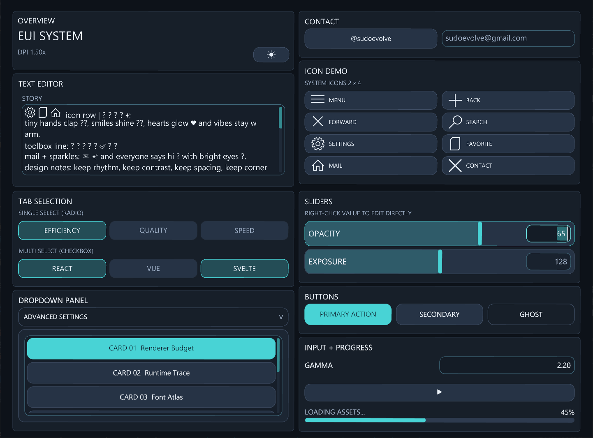
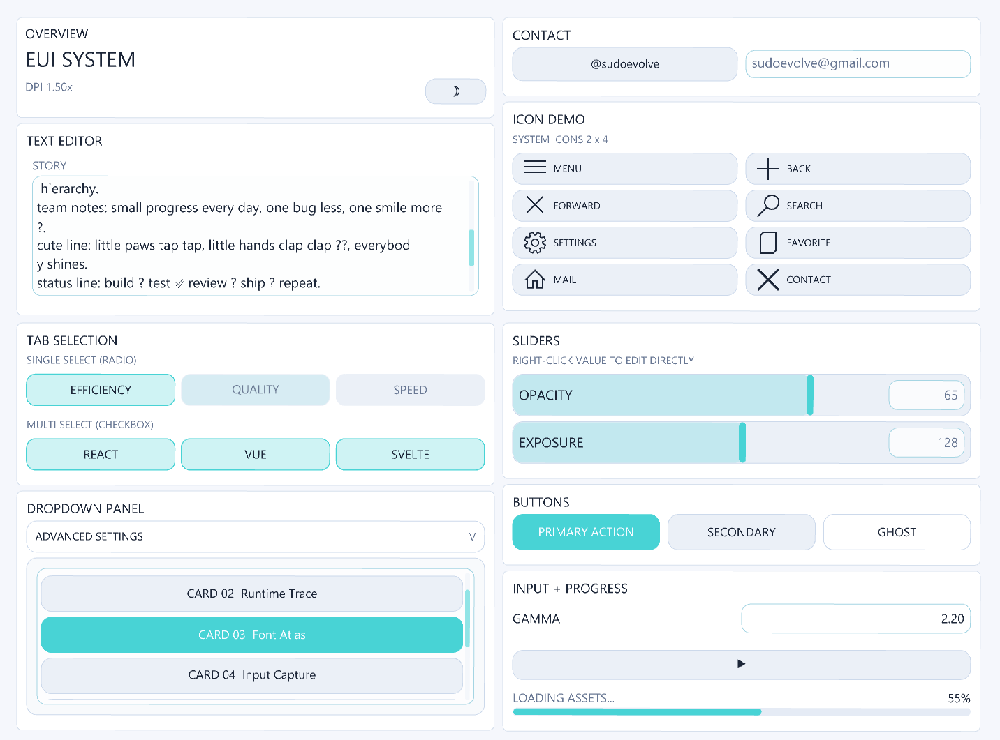

# EUI

[中文说明](readme.zh-CN.md)

EUI is a lightweight, header-only C++ UI toolkit focused on practical immediate-mode workflows.
The core API in `include/EUI.h` generates draw commands only.
A GLFW + OpenGL demo runtime is available when `EUI_ENABLE_GLFW_OPENGL_BACKEND` is enabled.

## Preview




## Project Analysis (Current Code)

### 1) Architecture

- **Core layer (`eui::Context`)**
  - Immediate-mode UI API that emits `DrawCommand` + text arena.
  - No hard dependency on GLFW/OpenGL for core usage.
- **Optional demo runtime (`eui::demo`)**
  - Window/input loop, DPI extraction, clipboard bridge, frame scheduling.
  - Calls your UI builder callback with `FrameContext`.
- **Renderer layer (inside `EUI.h`)**
  - OpenGL command renderer with clipping and batching.
  - Win32 path uses GDI/wgl glyph lists for font rendering (text + icon fallback).
  - Non-Windows path includes a built-in bitmap-font fallback path.

### 2) Rendering Pipeline

1. `ui.begin_frame(...)`
2. Build UI widgets and layout.
3. `ui.take_frame(...)` gets command buffer + text arena.
4. Runtime hashes frame payload.
5. If unchanged, skip redraw.
6. If changed, compute dirty regions vs previous frame.
7. Repaint only dirty scissor regions; reuse cached framebuffer texture for the rest.

### 3) Performance Mechanisms Already Implemented

- Event-driven rendering (`continuous_render = false` by default).
- Frame hash early-out to avoid redundant GPU work.
- Dirty-region diff between previous and current draw command streams.
- Cached framebuffer texture + partial redraw via scissor.
- Clip stack + command clipping in core.
- Tile-assisted command bucketing for large command counts.

## Implemented Features (v0.1.0)

### Theme

- `ThemeMode` (`Light` / `Dark`)
- Primary color (`set_primary_color`)
- Corner radius (`set_corner_radius`)

### Layout

- `begin_panel` / `end_panel`
- `begin_card` / `end_card`
- `begin_row` / `end_row`
- `begin_columns` / `end_columns`
- `begin_waterfall` / `end_waterfall`
- `spacer`

### Widgets

- `label`
- `button` (`Primary`, `Secondary`, `Ghost`)
- `tab`
- `slider_float` (drag + right-click numeric edit)
- `input_float` (caret, selection, `Ctrl+A/C/V/X`)
- `input_readonly`
  - supports `align_right`, `value_font_scale`, `muted`
- `progress`
- `begin_dropdown` / `end_dropdown`
- `begin_scroll_area` / `end_scroll_area`
  - drag, wheel, inertia, overscroll bounce, scrollbar options
- `text_area` (editable, selection, caret, scrolling)
- `text_area_readonly`

### Output / Integration

- `end_frame()` returns `std::vector<DrawCommand>`
- `take_frame(...)` for moving frame buffers out efficiently
- `text_arena()` returns text storage used by text commands

## Repository Layout

```text
EUI/
|- include/
|  `- EUI.h
|- examples/
|  |- basic_demo.cpp
|  `- calculator_demo.cpp
|- CMakeLists.txt
|- index.html
|- readme.md
`- readme.zh-CN.md
```

## Build

Recommended generator: `Ninja`.

### 1) Build core only (no GLFW required)

```bash
cmake -S . -B build -G Ninja -DEUI_BUILD_EXAMPLES=OFF
cmake --build build
```

Targets:

- `EUI::eui` (interface)

### 2) Build demos (GLFW + OpenGL)

```bash
cmake -S . -B build -G Ninja -DEUI_BUILD_EXAMPLES=ON
cmake --build build
```

When OpenGL + GLFW are available, CMake creates:

- `eui_demo` (`examples/basic_demo.cpp`)
- `eui_calculator_demo` (`examples/calculator_demo.cpp`)

Important options:

```bash
-DEUI_BUILD_EXAMPLES=ON|OFF
-DEUI_STRICT_WARNINGS=ON|OFF
-DEUI_FETCH_GLFW_FROM_GIT=ON|OFF
-DEUI_GLFW_GIT_TAG=3.4
```

If network/Git access is restricted:

```bash
cmake -S . -B build -G Ninja -DEUI_BUILD_EXAMPLES=ON -DEUI_FETCH_GLFW_FROM_GIT=OFF
```

## Run Examples

```bash
# core demo
cmake --build build --target eui_demo

# calculator demo
cmake --build build --target eui_calculator_demo
```

## Minimal Core Usage

```cpp
#include "EUI.h"

eui::Context ui;
eui::InputState input{};

float value = 0.5f;
bool advanced_open = false;

ui.begin_frame(1280.0f, 720.0f, input);
ui.begin_panel("Demo", 20.0f, 20.0f, 640.0f);

ui.begin_row(2, 8.0f);
ui.button("Run", eui::ButtonStyle::Primary);
ui.input_float("Value", value, 0.0f, 1.0f, 2);
ui.end_row();

if (ui.begin_dropdown("Advanced", advanced_open, 80.0f)) {
    ui.progress("Loading", 0.42f);
    ui.end_dropdown();
}

ui.end_panel();

const auto& commands = ui.end_frame();
const auto& text_arena = ui.text_arena();
```

## Optional Demo Runtime Usage

```cpp
#define EUI_ENABLE_GLFW_OPENGL_BACKEND 1
#include "EUI.h"

int main() {
    eui::demo::AppOptions options{};
    options.width = 960;
    options.height = 710;
    options.title = "EUI Demo";
    options.vsync = true;
    options.continuous_render = false;
    options.max_fps = 240.0;

    options.text_font_family = "Segoe UI";
    options.icon_font_family = "Segoe MDL2 Assets";
    options.enable_icon_font_fallback = true;

    return eui::demo::run(
        [&](eui::demo::FrameContext frame) {
            auto& ui = frame.ui;
            ui.set_theme_mode(eui::ThemeMode::Dark);

            ui.begin_panel("Demo", 20.0f, 20.0f, 320.0f);
            ui.label("Hello EUI");
            ui.end_panel();

            // request_next_frame() if animation is needed in event-driven mode.
            frame.request_next_frame();
        },
        options
    );
}
```

## Notes

- `index.html` is a visual/prototype reference, not part of C++ build output.
- Keep source files in UTF-8 to avoid C4819/garbled literal issues on Windows toolchains.
